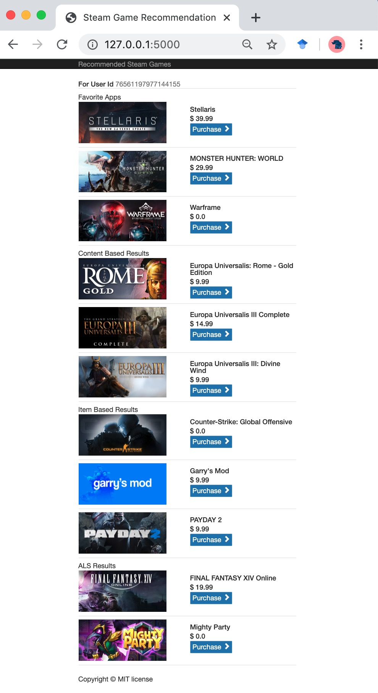

# A steam game recommender
-----
An Web steam game recommender by collaborative filtering method based on 7699 user 
experiences on up-to-date 920000 steam games. [Steam games](https://store.steampowered.com/)

Authors: Jingjie Zhnag (jjzhang369@gmail.com)

# Table of Contents
-----

*   [Directory Layout](#directory-layout)
*   [Installation](#installation)
*   [Usage](#usage)
    *   [Scape data](#scape-the-data)
    *   [Build and manage a Steam game MySQL database](#build-and-manage-a-steam-game-mysql-database)
    *   [Build a recommendation system](#build-a-recommendation-system)
    *   [Run the steam game recommendation engine](##run-the-steam-game-recommendation-engine)

# Directory Layout
-----

```
.
|--- data                            # folder for scaped steam game informations; sample data files are provided for demo/test purposes.
|      |--- steam_user_id.txt        # public information shared steam user ids. 
|      |--- steam_owened_games.txt   # in src folder, run `python main.py -su` to get this users information file.      
|      |--- steam_app_details.txt    # in src folder, run `python main.py -sg` to get this games information file.
|--- src                             # Scripts
|      |--- main.py
|      |--- user_owned_games.py  
|      |--- game_details.py
|      |--- recommendation.py
|      |--- config.yaml              # configuration file. Set you database information here.
|--- templates  
|      |--- recommendation.html      # Templates for the website.
|--- run_web_app.py                  # run the web recommendation engine
|--- requirements.txt
└--- README.md

```

# Installation
-----

* Install the requirements using ```pip install -r requirements.txt```.
* Make sure to use the Python 3 version (we recommend using [Anaconda](https://anaconda.org/anaconda/python) python distribution).
* It is recommended to use virtual environment to have a clean package setup.

# Usage
-----

Clone this repo to your computer (it comes with smaller sample inputs for test/debug purposes).

Building this STEAM games recommender involves five steps. 
Each step is created as an indepndent command and all tasks are grouped in the ```main.py``` file
for simplicity.

In the `./src` folder:

* Run ```python main.py -h``` to see what commands (task) are available.
* Run ```python main.py COMMAND [ARGS]``` to run each task.

## Scape the data

In the `./src` folder:

* Run ```python main.py -sg``` or ```python main.py --scapegames``` to scape all the STEAM games informations. 
The games informations are stored in ```data/steam_app_details.txt```.

Steam provides API calls to provide information about Steam users who agreed to share their owned games. 
* Run ```python main.py -su``` or ```python main.py --scapeusers``` to scape the STEAM public shared user 
informations. The user informations are stored in ```data/steam_owned_games.txt```.

Check the STEAM APIs:
[Steam Web API Documentation](https://steamcommunity.com/dev)
[Valve developer community](https://developer.valvesoftware.com/wiki/Steam_Web_API)

## Build and manage a Steam game MySQL database

__Make sure you have MySQL installed beforehand__**

* In MySQL, create a database named _steam_. You can change the database name in the `config.yaml` if you like.
* Setup the __username__ and __password__ for the database in `config.yaml`. 

In the `./src` folder:

* Run ```python main.py -tg``` or ```python main.py --tablegames``` to create and save the steam game informations in a table __game_steam_app__ in the database __steam__. 
* Run ```python main.py -tu``` or ```python main.py --tableusers``` to create and save the steam public shared user informations in a table __game_steam_user__ in the database __steam__. 


## Build a recommendation system

Four recommendation approaches are introduced in this recommendation system:

* Popularity based: Recommend the games based on the number of people played. This data is scaped from [Steam statistics API](https://store.steampowered.com/stats).
* Conntent based  : Recommend the games based on the similarity between games descriptions. 
* Collaborative filtering - item based
* Collaborative filtering - Alternative Least Square model based. 

In the `./src` folder:

* Run ```python main.py -r``` or ```python main.py --recommendation``` to build the recommendation similarity matrix and save to the __steam__ database. 


## Run the steam game recommendation engine

Run: `python run_web_app.py` 

The steam game recommendation engine can be found on `http://127.0.0.1:5000/`. The main application looks like this:

<br>
<div align="center">
  
</div>
